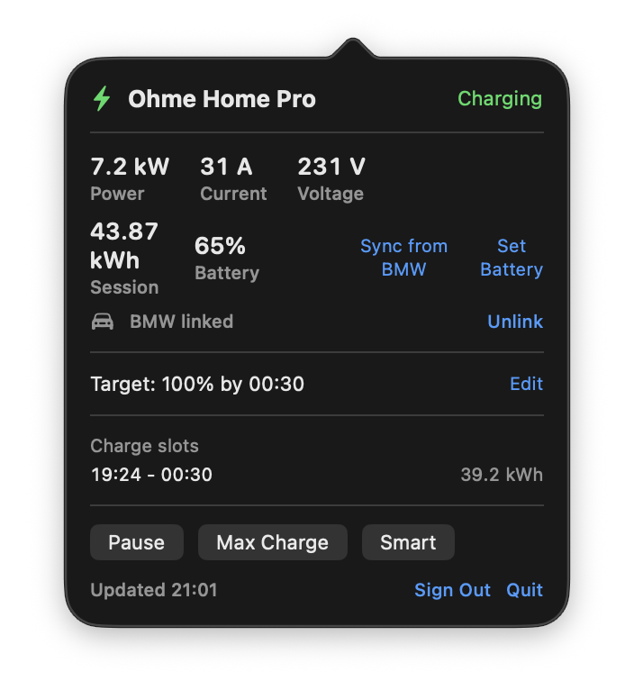

# OhmeBar

A macOS menu bar app for monitoring and controlling Ohme EV chargers. Live
power, charge slots and full charge control from your Mac - plus optional
BMW CarData integration that keeps Ohme's battery estimate accurate.

> OhmeBar is an unofficial, community project. It is not affiliated with,
> endorsed by, or supported by Ohme Operations UK Ltd or BMW Group.



## Features

Works with any Ohme charger and any EV - no BMW required:

- Menu bar icon that reflects charger state at a glance: charging, plugged
  in, paused, finished, pending approval, unplugged
- Live power readings: kW, amps, volts, session energy and battery percent
- Tonight's charge slots with per-slot energy
- Pause / resume, Max Charge / Smart mode, and approve-charge controls
- Edit the charge target (percent and ready-by time) inline
- Set the car's state of charge manually so Ohme's target maths stays honest
- Polls every 30 seconds while open, every 2 minutes in the background
- Launch at login, error badge in the menu bar, no Dock icon

Optional extra for BMW and MINI drivers:

- Link a BMW CarData client once, and OhmeBar automatically pushes the car's
  real battery level into Ohme every time you plug in - restoring the
  accurate target-based charging that disappeared when BMW cut off
  third-party API access

## Why the BMW integration exists

Ohme used to read the battery level of many cars (BMW included) through the
car makers' unofficial mobile-app APIs. In late 2025 BMW blocked all
third-party access to those APIs and Ohme silently dropped BMW from its
supported brands, so the Ohme app now relies on a state of charge you typed
in at plug-in time, extrapolated as the charge progresses. If that starting
figure is stale, your "charge to 80%" target quietly becomes wrong.

BMW's official replacement is BMW CarData, a customer-facing API available
in the EU and UK. OhmeBar speaks CarData directly: at plug-in it fetches the
car's true state of charge and writes it into your Ohme account, so the
Ohme app (and OhmeBar) compute the charge from reality. No Home Assistant,
no cloud middleman - the Mac talks to BMW and Ohme directly.

## Requirements

- macOS 13 Ventura or later (Apple Silicon build provided; Intel users can
  build from source)
- An Ohme account with email/password login. If you signed up with Google or
  Apple, do a password reset on the Ohme account first - the API only
  supports email/password (same limitation as the Home Assistant
  integration).
- For the BMW extra: a BMW or MINI with ConnectedDrive, registered to a BMW
  ID in the EU or UK, and access to the BMW CarData portal. The BMW ID must
  be the vehicle's primary driver.

## Install

### Download

Grab the notarized build from [Releases](../../releases), unzip, drag
`OhmeBar.app` to Applications and launch. The bolt icon appears in the menu
bar; there is no Dock icon or main window.

### Build from source

```sh
brew install xcodegen
git clone https://github.com/beaglemoo/ohmebar.git
cd ohmebar
xcodegen generate
xcodebuild -scheme OhmeBar -configuration Release build
```

Or `./build.sh` for a standalone ad-hoc-signed bundle in `build/OhmeBar.app`.
Run the tests with `xcodebuild -scheme OhmeBar test`.

## Setup

### 1. Sign in to Ohme

Click the bolt icon and enter your Ohme account email and password. The
password goes into the macOS Keychain, nowhere else. Charger status appears
within a few seconds. Right-click the icon for Refresh, Launch at Login,
Sign Out and Quit.

### 2. Link BMW CarData (optional)

One-time setup, roughly five minutes:

1. Sign in to the [BMW CarData portal](https://bmw-cardata.bmwgroup.com/customer/public/home)
   with the BMW ID that owns the car (the same login as the My BMW app).
   You can also reach it via your national BMW site -> My BMW -> select the
   car -> BMW CarData.
2. Under "Technical access to BMW CarData", create a CarData client.
3. Turn ON "Request access to CarData API". Wait a minute.
4. Turn ON "CarData Stream". Wait another minute. (OhmeBar never uses the
   stream, but BMW's consent check wants both subscriptions enabled.)
5. Copy the client ID.
6. In OhmeBar's popover, click "Link BMW CarData", paste the client ID and
   click Link.
7. OhmeBar shows a short pairing code and opens the BMW approval page.
   Make sure the code on the page matches the one in the popover (clear the
   field and re-enter it if not), then approve. Codes expire after 5
   minutes.
8. The popover flips to "BMW linked" and does its first sync immediately.

From then on, every time the car is plugged in, OhmeBar fetches the real
state of charge from BMW and pushes it into Ohme before the smart charge is
calculated. A "Sync from BMW" button is also available any time.

## Troubleshooting the BMW link

These are real failure modes we hit while building this, with fixes:

**"access_denied" immediately after you approve, every time.** The CarData
client itself is defective - BMW sometimes issues client credentials that
never propagate to its auth servers. The token endpoint briefly returns an
internal 500 (`keymanagement.service.invalid_access_token`) when you
approve, and the request is then recorded as "user declined". No amount of
retrying fixes that client. Solution: in the CarData portal, Delete Client,
create a new one, re-enable BOTH toggles (a minute apart), wait a few more
minutes, then link with the new client ID. This fixes it for almost
everyone.

**The approval page shows a different code than OhmeBar.** BMW's approval
page caches the last code it saw. Approving a stale code silently kills the
current pairing attempt. OhmeBar passes the code in the URL to defeat this,
but if the field still differs, clear it and type the code from the
popover. The code is case-sensitive.

**The approval page says "Link your BMW ID to your car - please continue in
the vehicle".** Despite appearances this is also the device-approval page;
the wording is shared with BMW's in-car login flow. As long as the code
matched, the approval registered. If pairing still fails afterwards, see
the defective-client fix above.

**Quota.** BMW allows 50 CarData API calls per day per account. A sync
costs one call (two on the very first, to discover the VIN, and one extra
whenever the descriptor container needs recreating). OhmeBar only syncs at
plug-in and on demand, so normal use is a handful of calls a day. If you
hit 429 errors, you have exhausted the day's quota.

**Approving from the wrong BMW account.** The approval must come from the
same BMW ID that owns the CarData client, and that BMW ID must be the
car's primary driver. Approvals from any other account are denied.

## How it works

- **Ohme**: authenticates against Ohme's Firebase identity project with
  your email/password, then calls `api.ohme.io` - the same unofficial API
  used by the [Home Assistant Ohme integration](https://www.home-assistant.io/integrations/ohme/)
  and [ohmepy](https://github.com/dan-r/ohmepy). Endpoints: charge sessions,
  next session rule, account/device info, pause/resume/approve, max-charge,
  charge-rule PATCH, state-of-charge PUT.
- **BMW**: OAuth 2.0 Device Code flow with PKCE against BMW's GCDM identity
  service, then the official CarData REST API (`api-cardata.bmwgroup.com`).
  OhmeBar registers a small "descriptor container" for the two battery
  descriptors and polls `telematicData` with it. Reference implementations:
  [bmw-cardata-ha](https://github.com/kvanbiesen/bmw-cardata-ha).
- Tokens auto-refresh (Ohme ~45 min, BMW per expiry). All secrets live in
  the macOS Keychain.

## Privacy

- Credentials are stored only in the macOS Keychain on your Mac.
- OhmeBar talks exclusively to Ohme (`api.ohme.io`), Google Identity
  (Ohme's login provider) and BMW (`customer.bmwgroup.com`,
  `api-cardata.bmwgroup.com`). No telemetry, no analytics, no third-party
  servers.
- The Firebase API key in the source is Ohme's public web client key,
  shipped in their own apps - it is not a secret.

## Caveats

- The Ohme API is unofficial and can change without notice. If something
  breaks, check ohmepy and the Home Assistant integration for the current
  endpoint shapes.
- BMW CarData is EU/UK only and the readings are as fresh as the car's last
  report to BMW (typically at ignition-off and charging events).
- Price cap, solar mode and multi-vehicle selection are not exposed yet -
  see the roadmap.

## Roadmap

- Charge history with charts
- Price cap and solar mode toggles for chargers that support them
- Multi-vehicle selection
- Sparkle auto-updates and a Homebrew cask

## Credits

- [dan-r](https://github.com/dan-r) for ohmepy and the Home Assistant Ohme
  integration, which document the Ohme API
- [kvanbiesen](https://github.com/kvanbiesen) and
  [JjyKsi](https://github.com/JjyKsi) for the BMW CarData Home Assistant
  integrations, which document the CarData device flow

## License

MIT - see [LICENSE](LICENSE).
